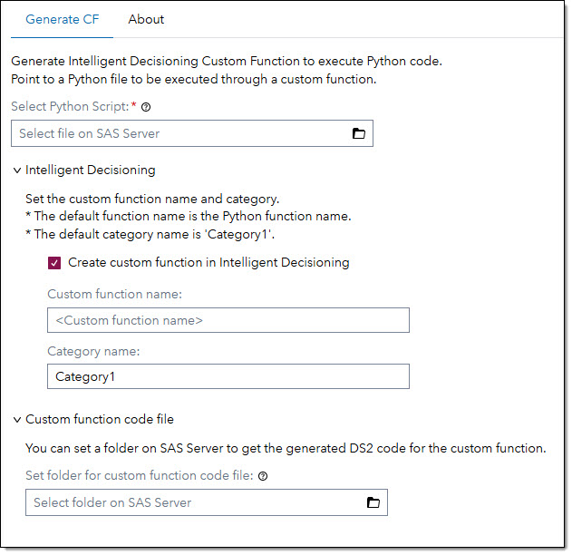

# SID - Generate PY Custom Function #

## Description ##
This step creates a custom function in Intelligent Decisioning to execute a Python program as part of the custom function.
The step will take a Python file as input parameter, generates the necessary DS2 code to execute the Python code and creates the appropriate custom function in Intelligent Decisioning.

## User Interface ##

### Generate CF tab ###

At tab Generate CF you set the Python program file and some step options as required.



| UI Field | Comment | 
| --- | --- |
| Select Python Script | Select the Python script from SAS server that is going to be executed in the custom function. |
| Create custom function in Intelligent Decisioning | If this switch is on the step will create a custom function in Intelligent Decisioning.<br>If the switch is off the step will not create a custom function in Intelligent Decisioning.<br>**Default:** Switch is set to on. |
| Custom function name | Set the name for the custom function. If no name is set the custom function name is the same name as the Python function to be called.<br>**Default:** No custom function name is set. |
| Category name | Set the name for the custom function category in Intelligent Decisioning. If no name is set the custom function is created in category 'Category1'. If the category name does not exist in Intelligent Decisioning, the step will create the appropriate category.<br>**Default:** The default category name is Category1. |
| Set folder for custom function code file | You can set a folder on SAS server for the function DS2 code that is generated. You can use the generated code to manually create the custom function is required.<br>**Default:** No folder is set. |

---

## Create Custom Function ##
The step will generate DS2 code for the custom function.<br>
To execute Python code via a custom function the DS2 package [PyMAS](https://go.documentation.sas.com/doc/en/mascdc/default/masag/n0b478i3vsj1pqn1dht0ctsorlet.htm) is requred. The PyMAS instance in the custom function needs to be global. If a local instance is used it will create a memory leak in MAS or SCR when the custom function is called.<br>

### Global PyMAS instance ###
To initialize a global instance of PyMAS you need to add a [Custom Context](https://go.documentation.sas.com/doc/en/edmcdc/default/edmug/n15q9f3hiex347n1fdgtlq5qcpgt.htm)
 file to the decision flow where you call the custom function.<br>

 The step will generate a unique variable name per custom function for the PyMAS instance. This way you can have several PyMAS variables in the same custom context file. One for each custom function that is calling Python code.<br>

 ### Global message logger instance ###
 You also need a global instance for the message logger that is used in the custom function. As all custom functions can use the same message logger. Only one instance of the message logger is needed in the custom context file.<br>

 ### Prepare custom context file ###
 When the step has created the custom function, you can open the function body in Intelligent Decisioning. At the top of the function code you'll find a comment section with the DS2 code required in the custom context file.
 ```
 * Declare the variable logr in the Custom Context file. Variable logr must only to be declared once in the Custom Context file!
*    dcl package logger logr('App.tk.SID.Python');
* Declare the pymas variable helloWorld_py in the Custom Context file.
*    dcl package pymas helloWorld_py;
```
Copy the *dcl package* statements into the custom context file that you use with the decision flow where the custom function is called. Note, that only one *dcl package logger* statement is needed per custom context file!

### Input output variables ###
By default, all variables discovered in the Python function head and in the 'Output:' doc string will be used as parameters in the custom function head.<br> All input parameters are declared as *varchar(30)* and all output parameters are declared as *in_out varchar*. If a different parameter type or size is required it needs to be changed manually. 

If you change the parameter type you need to adjust the PyMAS *set parameter* and *get parameter* functions in the code. Scroll to the end of the function body where you'll find the appropriate sections to adjust. See [documentaion](https://go.documentation.sas.com/doc/en/mascdc/default/masag/p0j05fz6ik4b62n1lhutt0z08fel.htm) for available *set parameter* and *get parameter* functions.

When you have prepared the custom context file and adjusted the generated code as necessary you can use the custom function in DS2 code files, Rule Sets or other custom functions.

---

## Requirements <a name="requirements-"></a>
* SAS Viya 2025.01 or later.
* Python needs to be installed and configured to work with SAS Studio.
* The SAS Viya environment needs to be set up to allow calling SAS Viya services from within SAS Studio. If you cannot call SAS Viya services you will receive a time out error. In this case check with your SAS Viya administrator.

---

## Usage ##
Create a custom function in Intelligent Decisioning and use it in a decision flow.


## Change Log ##
Version 1.0 (21MAR2025)<br>
   * Initial version 

